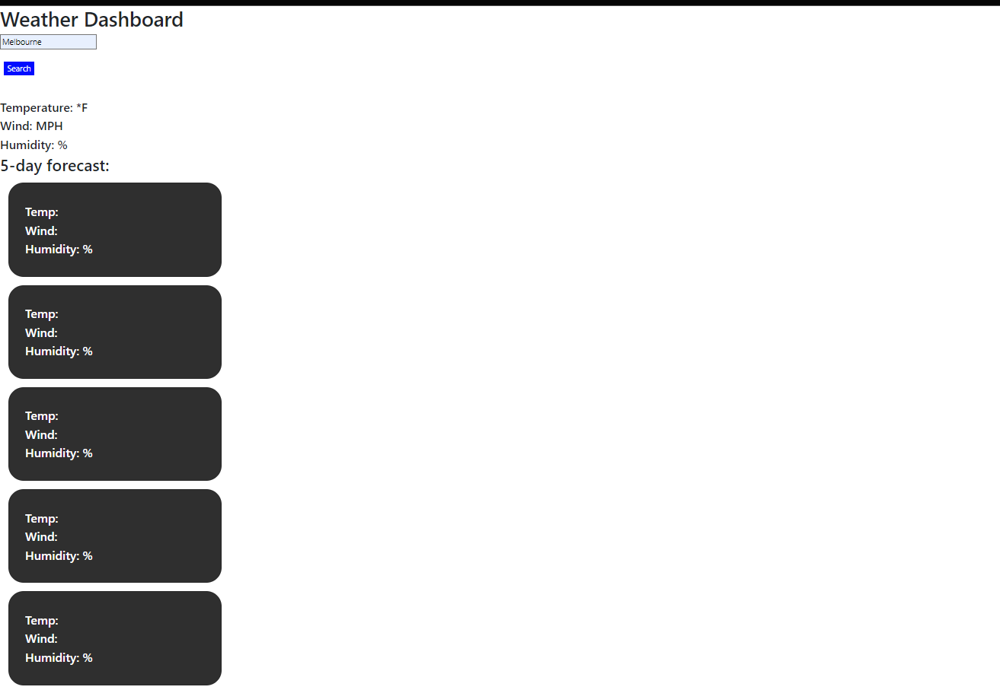

# 06-TellMeTheWeather

## <strong>Description</strong>

For Module 6, we are tasked with using a weather API to create a weather tracking website

## <strong>Acceptance Criteria</strong>

♦ When searching for a city, you are presented with future weather conditions for that city and added to history

♦ When viewing the weather, you are presented with city name, date, condititions, temp, humidity

♦ When viewing, there is an icon representation of weather conditions, temp, speed, and humidity

## <strong>Criteria Met</strong>

♦ Basic criteria framework met for HTML and CSS of website

♦ 1/2 of the API Javascript fulfilled

♦ Unable to have enough time to complete this project

### <strong>Website Link</strong>

https://github.com/FleischmanJ88/06-TellMeTheWeather

### <strong>Screenshot</strong>

### <strong>Contact Information</strong>

https://github.com/FleischmanJ88